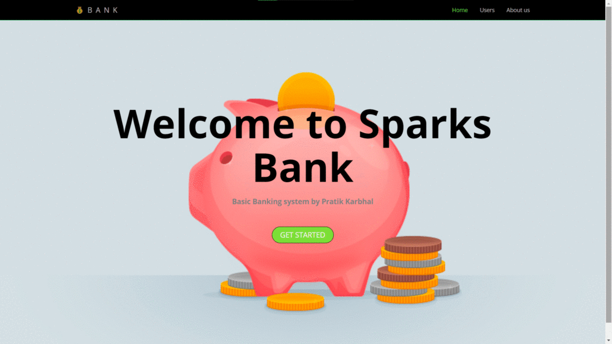

# Website is live - [See Preview](https://pratikkarbhal.github.io/Basic-Banking-System/).

# Results

# Problem statement
Basic-banking-system

◇ Create a simple dynamic website which has the following specs. 

◇ Start with creating a dummy data in database for upto 10 customers. 
	Transfers table will record all transfers happened. 
	
◇ Flow: (Index.html)Home Page > View all Customers > Select and View one Customer > Transfer Money > Select customer to transfer to > View all Customers . 

◇ No Login Page. No User Creation. Only transfer of money between multiple users.
